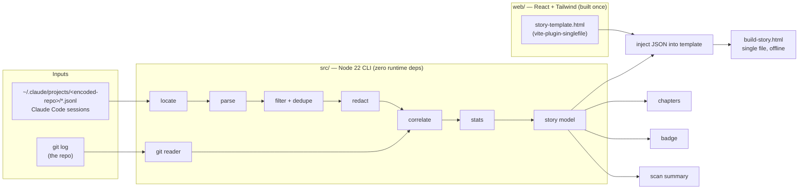

# Said & Done — Architecture

How the system is built and why. Requirements live in [PRD.md](PRD.md) and visuals in [DESIGN.md](DESIGN.md). This file covers the structure, data flow, algorithms and the rules that keep them working.

---

## 1. Overview

Two parts, one direction of data flow:



- **CLI (`src/`)** does all the data work. It's deterministic and tested with `node:test`.
- **Web app (`web/`)** is a pure renderer for one JSON document. At package build time it's compiled once into `story-template.html`, with all JS and CSS inlined.
- **`said build`** puts a story into the template. It never runs Vite or Tailwind, so users don't need the web toolchain.

## 2. Repository layout

```
said-and-done/
├─ README.md               # public face of the project
├─ CLAUDE.md               # instructions for Claude Code (must stay at the root)
├─ package.json            # bin "said" → dist/cli.js; workspace scripts
├─ docs/                   # PLAN, PRD, DESIGN, ARCHITECTURE, RECORDING
├─ src/
│  ├─ cli.ts               # argument parsing (node:util parseArgs), dispatch, exit codes
│  ├─ commands/            # scan.ts · build.ts · chapters.ts · badge.ts · hook.ts
│  ├─ sessions/            # locate.ts (find session dir) · parse.ts (JSONL → events)
│  ├─ git/                 # log.ts (git log → commits)
│  ├─ story/               # model.ts (types) · correlate.ts · stats.ts · assemble.ts
│  ├─ redact.ts            # patterns + redactText()
│  └─ render/              # inject.ts (template + JSON → HTML) · badge-svg.ts
├─ test/
│  ├─ *.test.ts            # one file per module
│  └─ fixtures/            # trimmed, redacted JSONL extracts + tiny git repos made by scripts
├─ web/
│  ├─ index.html           # contains the story-data script tag + theme bootstrap
│  ├─ story.sample.json    # dev fixture, same schema as real output
│  └─ src/                 # main.tsx · App.tsx · components/ · lib/ (loadStory, format, replay)
└─ dist/                   # build output (git-ignored): cli.js … + story-template.html
```

## 3. Build and runtime

| Concern | Decision |
|---|---|
| Runtime | Node ≥ 22. ESM only (`"type": "module"`). |
| CLI build | `tsc` → `dist/`. `strict: true`. |
| Tests | `node:test` + `node:assert/strict`, running TypeScript through `tsx` (`node --import tsx --test`). |
| Web build | Vite + `@vitejs/plugin-react` + `@tailwindcss/vite` + `vite-plugin-singlefile`. Output copied to `dist/story-template.html`. |
| Root `build` script | Builds the web app, then copies the template, then runs `tsc`. The template is found at run time from `new URL("./story-template.html", import.meta.url)`. |
| CLI dependencies | None at runtime. Only Node built-ins: `fs`, `readline`, `child_process.execFile`, `util.parseArgs`, `path`, `os`. |
| Web dependencies | `react` and `react-dom` at runtime. Everything else is a dev dependency. |

The exact commands go in `CLAUDE.md` → **Commands** once the scaffold exists.

## 4. Reading sessions (`src/sessions/`)

### 4.1 Finding the session folder (`locate.ts`)
1. `repoRoot` = `git rev-parse --show-toplevel` from `--repo` (default: the current directory).
2. Candidate folder: `~/.claude/projects/` + `repoRoot` with **every non-alphanumeric character replaced by `-`**. Observed: `/Users/x/Study/Ai/hhgoa_task4` → `-Users-x-Study-Ai-hhgoa-task4`. The encoding loses information, so it's only used to find a candidate.
3. Fallback: if the candidate is missing, read the first 50 lines of each `*.jsonl` in every project folder and keep files with any `cwd` inside `repoRoot`.
4. `--sessions-dir` skips steps 2 and 3.

### 4.2 Parsing (`parse.ts`)
Stream each file line by line with `readline`. For each line:

| Condition | Action |
|---|---|
| `JSON.parse` throws | `malformed++`, continue |
| `type` is not `user` or `assistant` | `ignoredByType[type]++` (observed: `attachment`, `system`, `queue-operation`, `file-history-*`, `custom-title`, `ai-title`, `last-prompt`, `mode`, `permission-mode`, `relocated`, `cost-state`, …) |
| `isSidechain === true` | skip (sub-agent traffic) |
| `cwd` missing or not inside `repoRoot` | skip (`outOfRepo++`). Sessions can move between projects (`relocated`), so check every entry, not the file. |

**Is a `user` entry a human prompt?** All of these must hold:
- `isMeta !== true`
- `message.role === "user"`
- `message.content` is a string, or an array containing at least one `text` block and **no** `tool_result` block. Image blocks are allowed; they're counted but not shown.
- After joining the text blocks, the trimmed text **does not start with** any of: `<command-name>`, `<command-message>`, `<local-command-stdout>`, `<local-command-caveat>`, `<bash-input>`, `<bash-stdout>`, `<system-reminder>`, `[Request interrupted`.
- Remove any `<system-reminder>…</system-reminder>` blocks from the text. If nothing is left, it isn't a prompt.

Hints when present, never required: `origin.kind === "human"` confirms a prompt. `promptSource` (observed values `typed`, `sdk`) is stored but **not** used to claim "voice", because it can't tell speech from typing.

**File touches.** For `assistant` entries, every `tool_use` block named `Edit`, `Write`, `MultiEdit` or `NotebookEdit` with `input.file_path` (or `notebook_path`) inside `repoRoot` becomes a `FileTouch`. It's assigned to the most recent human prompt in the same session before it in time.

**Dedupe and sort.** Key = `promptId ?? uuid`. Sort by `timestamp`, then by file order.

### 4.3 Filters
`--since` and `--until` compare against prompt timestamps. `--exclude-session` drops whole sessions. Filters run **before** correlation and stats, so filtered prompts affect nothing.

## 5. Git and correlation (`src/git/`, `src/story/correlate.ts`)

**Reading.** `git log --reverse --format=<sha, ISO time, subject, separated by a delimiter> --numstat` via `execFile` (no shell). Binary files (`-\t-`) count as 0 lines. Author names and emails are never read.

**Linking prompts to commits** (both lists sorted by time):
1. Walk through the commits in order. Commit *cᵢ* takes every unassigned prompt with `timestamp ≤ cᵢ.time` that came after commit *cᵢ₋₁*.
2. Confidence: `files` if the files those prompts touched overlap with *cᵢ*'s changed files; otherwise `time`.
3. Prompts left after the last commit → `uncommitted`.
4. Commits that receive no prompts (for example, made before recording) are kept, with `prompts: []`.

This matches how the build actually happens: you speak a few prompts, then say "commit this". It needs no guessing about intent, and the confidence label stays honest about the weak cases.

## 6. Redaction (`src/redact.ts`)

`redactText(s) → { text, hits: Record<Kind, number> }`, applied to **prompt text, file paths and commit subjects** right after parsing, before anything is stored in the model.

| Kind | Pattern (summary) |
|---|---|
| `key` | Known prefixes (`sk-`, `sk-ant-`, `ghp_`, `gho_`, `github_pat_`, `xox[abp]-`, `AKIA`, `AIza`, `eyJ…` JWTs) and `KEY=…`/`TOKEN=…`/`SECRET=…` assignments |
| `secret` | Strings of 32+ characters from `[A-Za-z0-9+/_-]` with high Shannon entropy (≥ 3.5 bits/char), **excluding** hex-only strings of 7–40 characters (git shas) and canonical UUIDs |
| `email` | Standard email pattern |
| `home` | `/Users/<name>`, `/home/<name>`, `C:\Users\<name>` → `~` (this is a path rewrite, not a placeholder) |
| `ip` | Private IPv4 ranges (10/8, 172.16/12, 192.168/16) |

Placeholders look like `[redacted:<kind>]`. The web app recognises them and renders a `RedactedToken`. `build` prints a summary of the hits, and `--no-redact` sets `story.redacted = false`, which the page shows as a banner.

## 7. Story model (`src/story/model.ts`)

```ts
export interface Story {
  schemaVersion: 1;
  generatedAt: string;            // ISO
  generator: { name: "said-and-done"; version: string };
  repo: { name: string; remoteUrl?: string };   // https URL only, no credentials
  title: string;
  redacted: boolean;
  filters: { since?: string; until?: string; excludedSessions: string[] };
  sessions: Session[];
  prompts: Prompt[];               // sorted by time, globally numbered from 1
  commits: Commit[];               // sorted by time
  stats: Stats;
  diagnostics: ParseDiagnostics & { excludedByFilter: number };  // every parser count (src/sessions/parse.ts)
}
export interface Session { id: string; start: string; end: string; promptCount: number }
export interface Prompt {
  n: number; id: string; sessionId: string; at: string;
  text: string; words: number; files: string[];        // relative to the repo, deduped
  commitSha: string | null;                             // null = uncommitted
  source?: string;                                      // raw promptSource, informational
}
export interface Commit {
  sha: string; at: string; subject: string;
  files: { path: string; added: number; removed: number }[];
  added: number; removed: number;
  promptNs: number[]; confidence: "files" | "time" | "none";
}
export interface Stats {
  prompts: number; words: number; sessions: number; commits: number;
  filesTouched: number; activeMs: number; firstPromptToFirstCommitMs: number | null;
  longestPrompt: { n: number; words: number } | null;
  typingSavedMs: number;           // estimate; assumptions in PRD §8
}
```

`assemble.ts` is the only place a `Story` gets built. `scan --json` prints exactly this object.

## 8. Web app (`web/`)

- **Loading data** (`lib/loadStory.ts`): read `document.getElementById("story-data").textContent`. If it's still the placeholder `__SAID_STORY__` (dev mode), load `story.sample.json` through a Vite import that's only included in dev builds. If `JSON.parse` fails or `schemaVersion` is unknown, show the damaged-file panel.
- **State:** React state only. No router, store library or data fetching. Replay is a small `useReplay()` hook (cursor, playing, speed, timer).
- **Styling:** Tailwind v4 with the tokens and rules in [DESIGN.md](DESIGN.md). Class names are always written out in full.
- **Template `index.html`** contains:
  - `<meta http-equiv="Content-Security-Policy" content="default-src 'none'; script-src 'unsafe-inline'; style-src 'unsafe-inline'; img-src data:; base-uri 'none'; form-action 'none'">`
  - A theme bootstrap inline script that runs before first paint.
  - `<script id="story-data" type="application/json">__SAID_STORY__</script>`
- After `vite build`, a check fails the build if the placeholder or the CSP tag is missing, or if the CSS lacks the key component classes.

## 9. Injection (`src/render/inject.ts`)

```ts
const json = JSON.stringify(story)
  .replace(/</g, "\\u003c")
  .replace(/\u2028/g, "\\u2028")
  .replace(/\u2029/g, "\\u2029");
html = template.replace("__SAID_STORY__", () => json);   // function form: no $-pattern surprises
```

Escaping `<` means a prompt containing `</script>` or `<!--` can't break out of the data tag. The placeholder must appear exactly once, or `build` exits with an error. A test injects a prompt with `</script><script>alert(1)</script>` and checks that the HTML has exactly one closing data tag.

## 10. Chapters, badge and hook

- **Chapters** (`commands/chapters.ts`): take the commits with `start ≤ at ≤ end`. The offset is `at − start`, and the first chapter is forced to `0:00` with the title "Intro". Chapters under 10 s are merged into the next. Error if fewer than 3 remain. Format is `m:ss` under an hour and `h:mm:ss` from an hour.
- **Badge** (`render/badge-svg.ts`): a two-part flat SVG ("built by voice" │ "N prompts"), with segment widths estimated from character count (7 px per character for an 11 px Verdana-like font), plus `<title>` for accessibility. No external fonts or links.
- **Hook** (P2, `commands/hook.ts`): merges a `UserPromptSubmit` entry into `.claude/settings.json` that runs `said hook record`, which appends `{at, sessionId, text}` to `.said/ledger.jsonl`. Ledger entries are merged with transcript prompts and deduped on `sessionId` + timestamp within 2 s + text hash. Install and uninstall both print the JSON diff.

## 11. Errors and exit codes

| Code | Meaning |
|---|---|
| 0 | Success |
| 1 | Usage error (bad flags or a bad date) |
| 2 | No sessions found for the repo (message names the folders searched) |
| 3 | Git missing or failed |
| 4 | Template missing or damaged (package not built) |

Messages say what happened and what to try next. Stack traces only appear with `SAID_DEBUG=1`.

## 12. Testing strategy

| Layer | Approach |
|---|---|
| `parse` | Fixtures cut from real sessions (redacted, under 50 lines each), covering every exclusion rule in §4.2, malformed lines, unknown types, sidechains, relocated sessions and subfolder `cwd` values |
| `redact` | A table of must-redact and must-keep strings (shas, UUIDs, normal prose) |
| `git` + `correlate` | Temporary repos created in the test with fixed commit dates (`GIT_COMMITTER_DATE`) |
| `stats`, `chapters`, `badge` | Pure functions, table-driven tests |
| `inject` | Escaping and break-out test (§9); output is deterministic apart from `generatedAt` |
| End-to-end | `said build` on a fixture repo plus fixture sessions → the HTML contains the expected prompt count and opens through `file://` (checked manually on camera) |

## 13. Key decisions

| Decision | Why | Trade-off |
|---|---|---|
| Read session files after the fact (the hook is optional) | Captures everything from prompt #1 with no setup | Depends on an undocumented format, handled by defensive parsing and tests |
| One self-contained HTML file | Opens anywhere, hosts on Pages, no server, works offline | Story size grows with history (fine up to thousands of prompts) |
| Template built once, data injected | Users don't need Vite or Tailwind; output is deterministic | The template must be rebuilt when the UI changes |
| React + Tailwind v4 | User's choice; fast to build by voice; one token system for light and dark | Bigger than plain JS (within the NFR-2 budget) |
| Link commits to prompts by time, plus file-overlap confidence | Simple, explainable, matches the "commit this" workflow | Can mislink when work interleaves; the confidence label shows this |
| Zero-dependency CLI | Fast install, small attack surface, nothing to drift | Some hand-written helpers (argument parsing via `util.parseArgs`) |

## 14. Room to grow
- A `SessionSource` interface (`locate()`, `parse()` → `Prompt[]` and `FileTouch[]`) so other agents' formats can be added without touching correlation or rendering.
- Comparing two story JSONs; search and filters in the page.
